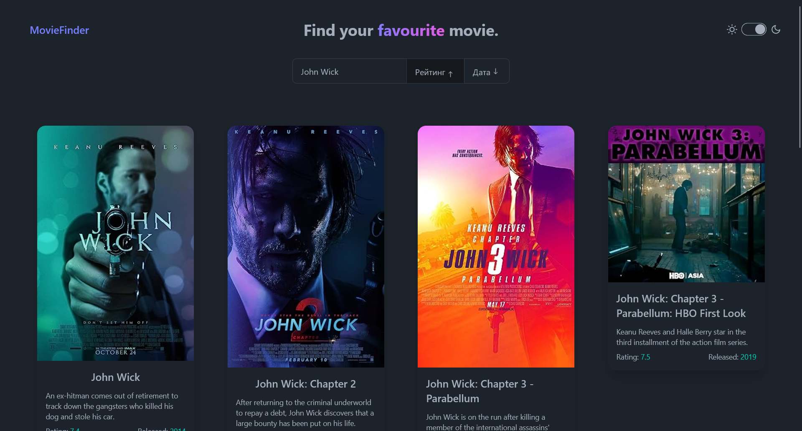

## Movie Finder

### This React app uses the [OMDb API](http://www.omdbapi.com/).

## Follow the link to see demonstration on github pages [Movie Finder](https://srapok.github.io/moviefinder/)

## Tech Stack

- `React`
- `Tailwind CSS`
- `React Redux`
- `React Router`
- `daisyUI`
- `axios`

## Setup

- Clone the repo with command `git clone https://github.com/SrapOK/movieFinder.git`
- Get an api key from [OMDb api](http://www.omdbapi.com/apikey.aspx)
- Create a `.env.local` file in the root directory
- Then set api key like this VITE_API_KEY=`YOUR API KEY`
- Run `npm i`
- Run `npm run dev`
- Open `http://localhost:5173` in your browser
